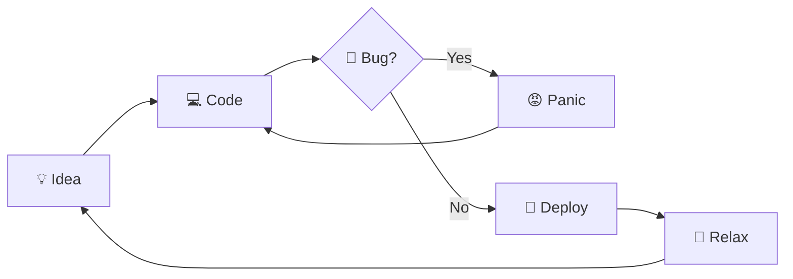

<h1 align="center">
    
</h1>

<h3 align="center">A passionate software developer from Italy 🇮🇹</h3>

<br/>

<div align="center">

 ✨ Creating bugs since **2022**

 🔭 I'm currently working on **a lot of things** 👨🏻‍💻
 
 🌱  I’m currently learning **everything** 🤓

🔒 **The most interesting projects are private**


 📫 You can reach me here : 
 
<div align="center">
  <a href="https://discordapp.com/users/1001158048276033536" target="_blank">
    
  </a>
  <a href="https://www.instagram.com/lenny.ts_" target="_blank">
    
  </a>
  </div>

  </div>


<hr/>

<h3 align="center">🍀 If I were a function...</h3>

```python
def lenny():
    """A passionate software developer from Italy 🍝"""
    languages = ["Python", "Go", "TypeScript", "Java", "C"]
    vibes = ["coding", "learning", "getting high 💨"]
    projects = ["a lot of things"]

    for vibe in vibes:
        while bug_found:
            refactor(create_feature_not_bug())
        if motivation_low:
            roll_joint()
            get_back_to_work()
        code(random.choice(projects))
        learn(random.choice(languages))
```

<br/>

<hr/>

<h3 align="center">🔄 DevLife Pipeline</h3>



<hr/>

<h3 align="center">📦 Deploy Journal</h3>

<br/>

<!-- DEPLOY_JOURNAL_START -->

| Project | Version | Date | Notes |
|:---|---:|---:|:---|
| [league_profile_tool](https://github.com/L9Lenny/league_profile_tool/releases/tag/v1.9.8) | v1.9.8 | 2026-07-05 | `League Profile Tool v1.9.8` |
| [Spotify-Playlist-Reader](https://github.com/L9Lenny/Spotify-Playlist-Reader/releases/tag/1.3) | 1.3 | 2024-09-24 | `1.3` |

<!-- DEPLOY_JOURNAL_END -->

<hr/>

<h2 align="center">⚒️ Languages-Frameworks-Tools ⚒️</h2>
<br/>

### 🌐 Languages
<div align="center">
    
</div>

### ⚙️ Frameworks & Libraries
<div align="center">
    
</div>

### 🛠️ Tools & IDEs
<div align="center">
    
</div>

### 💾 Databases
<div align="center">
    
</div>

### 🖥️ Operating Systems
<div align="center">
    
</div>

<br/>
<hr/>

<div align="center">
  <h2>🐍 My Contributions 🐍</h2>
  <br>
  
  
  <br/><br/><br/>
</div>

<hr/>

<h2 align="center">⚡ Stats ⚡</h2>
<br>

<div align="center">
  <table>
    <tr>
      <td></td>
      <td></td>
    </tr>
    <tr>
      <td></td>
      <td></td>
    </tr>
  </table>
</div>

<br/><br/>
<hr/>

<br/>
<div align="center">
<a href='https://ko-fi.com/profumato' target='_blank'></a>
</div>

<br/>
